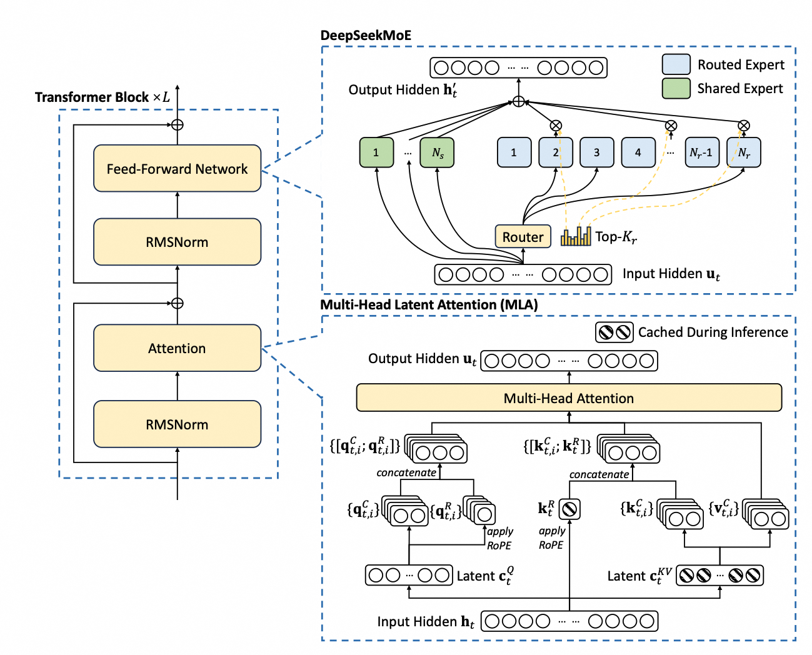

# DeepSeek-V3 技术报告学习- [DeepSeek-V3 技术报告学习](#deepseek-v3-技术报告学习)
  - [摘要](#摘要)
  - [引言](#引言)
  - [架构](#架构)

1. Link: https://arxiv.org/pdf/2412.19437 
2. Github: https://github.com/deepseek-ai/DeepSeek-V3.
3. Submitted on 27 Dec 2024 (v1), last revised 18 Feb 2025 (this version, v2)
   
[TOC]

## 摘要
- Mixture-of-Experts (MoE) language model
- Parameters : 671B total
  - (37B activated for each token)
- 技术亮点：
   - 与DeepSeek-V2一致的
     - Multi-head Latent Attention (MLA)
     - DeepSeekMoE architectures
   - auxiliary-loss-free strategy for load balancing
   - sets a multi-token prediction training
objective. 
- 预训练情况：
  - 14.8 trillion tokens
  - 2.788M H800 GPU hours
  - 训练过程稳定（Throughout the entire
training process, we did not experience any irrecoverable loss spikes or perform any rollbacks.）

## 引言
大语言模型发展【开源 + 闭源】， deepseek-v3目标：在低成本条件下，进一步缩小开源模型和闭源模型差距。

**在Deepseek-v2基础上的创新**：
- 最小化因负载均衡所带来的对模型性能的负面影响：auxiliary-loss-free strategy (Wang et al., 2024a) 
- employs a multi-token prediction training objective

**训练过程**：
- FP8 混合精度训练 
  - 首次在极大规模模型上验证了其有效性
- 训练框架：DualPipe 算法，实现了高效的流水线并行
  - 流水线停滞较少，并通过计算与通信重叠，隐藏了大部分训练过程中的通信开销
  - 随着模型规模的进一步扩展，只要我们保持恒定的计算与通信比，就仍然可以在各个节点间应用细粒度的专家分配，同时实现几乎为零的 all-to-all 通信开销
- 研发了高效的跨节点全连接（all-to-all）通信核，以充分利用 InfiniBand（IB）和 NVLink 带宽。
- 对内存开销进行精细优化，使得在不使用昂贵的张量并行的前提下也能训练 DeepSeek-V3。

**全流程**
1. 采用了14.8万亿高质量且多样化的tokens进行预训练，整个训练过程异常稳定
2. 对DeepSeek-V3进行了两阶段的上下文长度扩展：一阶段将最大上下文长度扩大至32K，二阶段则进一步扩展至128K
3. 后训练：监督微调（SFT）以及强化学习（RL），以使其更加契合人类偏好并进一步释放模型潜力。（在后训练阶段，我们对模型进行了DeepSeek-R1系列的推理能力蒸馏，同时也仔细权衡了模型精度与生成长度之间的平衡。）
   
**表现**
1. DeepSeek-V3-Base 已成为目前最强的开源基础模型，尤其在代码和数学方面表现突出，性能甚至可与领先的闭源模型（包括 GPT-4o 和 Claude-3.5-Sonnet）媲美。
2. 极具性价比的训练成本，得益于在算法、框架与硬件的优化协同设计
，每训练一万亿个 token 仅需消耗 18 万小时的 H800 GPU 计算。
3. DeepSeek-V3 全流程训练仅需 278.8 万 GPU 小时（假设 H800 GPU 的租赁价格为每小时 2 美元，则总训练成本仅为 557.6 万美元）
   - 预训练阶段可在不到两个月内完成，共计消耗 266.4 万 GPU 小时。
   - 上下文长度扩展消耗的 11.9 万 GPU 小时
   - 后训练的 0.5 万 GPU 小时

**贡献**
- 架构：负载均衡策略与训练目标
- 预训练：极致的训练效率：FP8 混合精度训练、突破跨节点 MoE 训练中的通信瓶颈、实现几乎完全的计算与通信重叠
- 后训练：DeepSeek-R1 的知识蒸馏

**核心评估结果总结**
- 知识：
  - 教育类基准测试 👍
  - 事实性知识评测，英文表现虽略逊于顶级闭源模型，中文事实性知识方面超越
- 数学、编程、工程基准测试：DeepSeek-V3 👍（工程略逊于Claude-Sonnet-3.5）
  
## 架构

**MLA**

MLA 的核心在于对注意力的 Key 和 Value 进行低秩联合压缩，从而在推理过程中减少 Key-Value（KV）缓存的占用。