# 1. 模型演进
## ViT
ViT（Vision Transformer）是Google于2020年提出的一种纯基于Transformer架构的视觉模型。ViT首次将NLP中成功的Transformer理念引入到计算机视觉领域，通过将图片划分为patch（小块）并进行序列建模，ViT在大规模数据集下取得了超越传统卷积神经网络（CNN, 如ResNet）的表现。

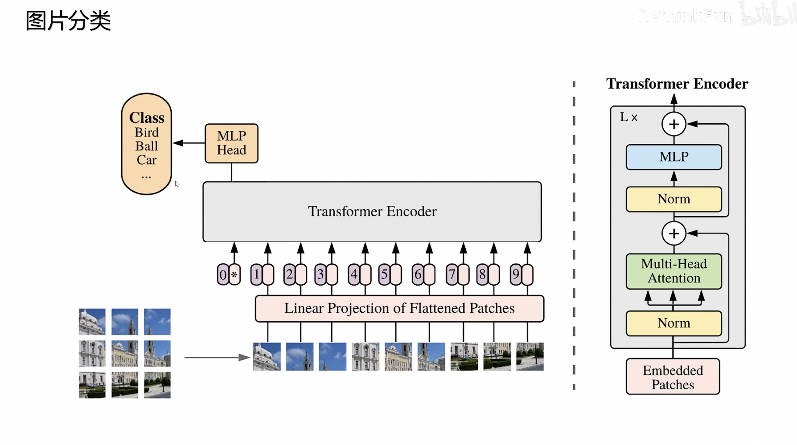
**思想要点**：
- Patch分割：将图片分割成固定大小的patch，每个patch展平成一维向量，patch大小为16*16，每个patch展平后为维度$P^2C$。
- 图像到序列（Transformer中hidden_size为1024）
  - 线性投影：共享(768, 1024)的线性投影层，得到patch embedding。
  - 定义1024个卷积核，每个大小为16*16，步长为16，padding为0
- 位置编码：与patch embedding相加，用于提供顺序信息
  - 1D：生成$N$个可学习向量，维度1024
  - 2D：生成$\sqrt{N}$个行向量和列向量，维度512
- Transformer编码：将patch embedding序列送入多层Transformer Encoder进行建模。
- 输出分类
  - 分类头：在输入序列前加上一个可训练的class token（类似于BERT的[CLS]），用于汇集全图信息，经过输出后用于分类任务，送入MLP头，输出类别概率。
  - 所有token全局平均池化

**算法优缺点**

- **优点**：
    - 长距离patch间依赖建模更强（全局自注意力）。
    - 统一视觉和语言的表征方式，方便多模态融合。
    - 在计算效率上，训练同等精度的模型，Transformer比卷积神经网络更具优势。
- **缺点**：
    - 比传统CNN参数多，计算开销大。
    - 小样本场景下表现不佳，需大量数据训练。【百万/千万/亿】

**可能遇到的问题**

- 为什么在计算效率上，训练同等精度的模型，Transformer比卷积神经网络更具优势？
  - Transformer自注意力机制高效建模长距离依赖，提高了信息表达能力，使同等精度下训练所需步骤更少，整体计算成本下降。
  - 自注意力支持序列级并行，与现代分布式训练高度契合，实现大模型训练的高效线性/超线性加速。
- ViT对图像尺寸有什么要求？
  - 必须能整除patch大小，通常输入图像尺寸设为224×224
  - 但位置编码需要与patch数量匹配，一般训练和推理建议保持和训练时一致的尺寸，否则可能出现位置编码不匹配的问题。
  - 在迁移学习或多尺度推理时，可以通过插值调整位置编码应对非标准输入【双线性插值：14*14*D -> 24*24*D：https://zhuanlan.zhihu.com/p/454605908】
- 混合模型？ResNet到特征图+Transformer
  - 混合模型受限于前端CNN提取能力，易造成特征损失和优化瓶颈。
- 卷积操作的归纳偏置？
  - 局部性和平移不变性
- 能够自监督来做？
  - 对于一半的patch做标记，80%为可学习的[mask], 10%替换为其他patch embedding， 10%不变，预测像素值8*8*8，效果很好
  - 训练过程中每个batch的mask位置是动态随机生成的，而不是固定不变的。
  - 让模型对“未被改变的、被替换的和被mask的”各种输入都增强鲁棒性，而不只是只学会填补 [MASK]，也不会过分依赖输入与输出重合
  - 真实下游任务不会出现 [MASK]，这项设计让模型学会在不同场景下预测，提升迁移能力。

## Clip
**CLIP**（全称：Contrastive Language-Image Pre-training）是 OpenAI 于 2021 年提出的多模态模型，通过**视觉（图像）和语言（文本）的大规模对比学习**，使模型能够理解图文之间的语义对应关系，实现图像与文本的通用语义特征对齐。

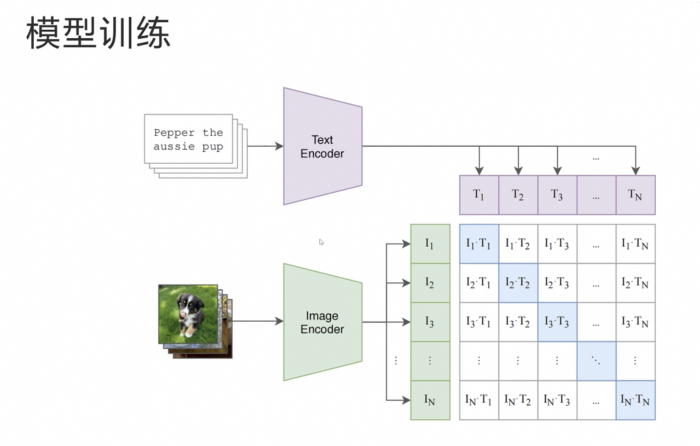

**核心思想**
- CLIP包括**两个编码器**：
  - 一个图像编码器（通常是ViT或ResNet）
  - 一个文本编码器（通常是Transformer）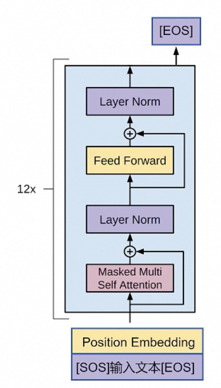
- 训练时，每张图片对应一条描述文本，模型将图片和文字分别编码为向量，**通过对比学习（Contrastive Learning）让同一组图片和文字特征更接近，不同组则更远**。
- 由于数据量足够大，图片编码器和文本编码器没有做预训练
- 图片数据增强：随机裁剪

**训练流程**

- 采集规模巨大的图片-文本对（训练数据：4亿个图文对）
- 图片输入视觉编码器，输出图像特征, 文字输入文本编码器，输出文本特征
- 计算每个 batch 内所有图片和文字的相似度矩阵 batch_size:32768
- 用对比损失（如 InfoNCE）促使正确的图片-文本对相似度最高
- 逐步训练，使模型有能力理解和映射开放域的多样语义
- 训练32个epoch
  
```python
I_e = l2_normalize(np.dot(I_f, W_i), axis=1)  # 图片特征归一化
T_e = l2_normalize(np.dot(T_f, W_t), axis=1)  # 文本特征归一化

logits = np.dot(I_e, T_e.T) * np.exp(t)

loss_i = cross_entropy_loss(logits, labels, axis=0)
loss_t = cross_entropy_loss(logits, labels, axis=1)
loss   = (loss_i + loss_t) / 2
```

**主要优势**

- 无需人工标签，直接利用网络数据大规模预训练，利用了丰富的语义作为监督，学习到很多细节的语义特征
- 连接图像和文本，可以利用文本来查询图像
- 能处理开放词汇和复杂语义，支持“零样本”图像分类、检索等
- 通用迁移性极强，下游任务效果优异

**典型应用举例**

- **零样本分类**（Zero-shot classification）：给定一个未见过的类别描述，CLIP可以判断哪张图片最像该描述
  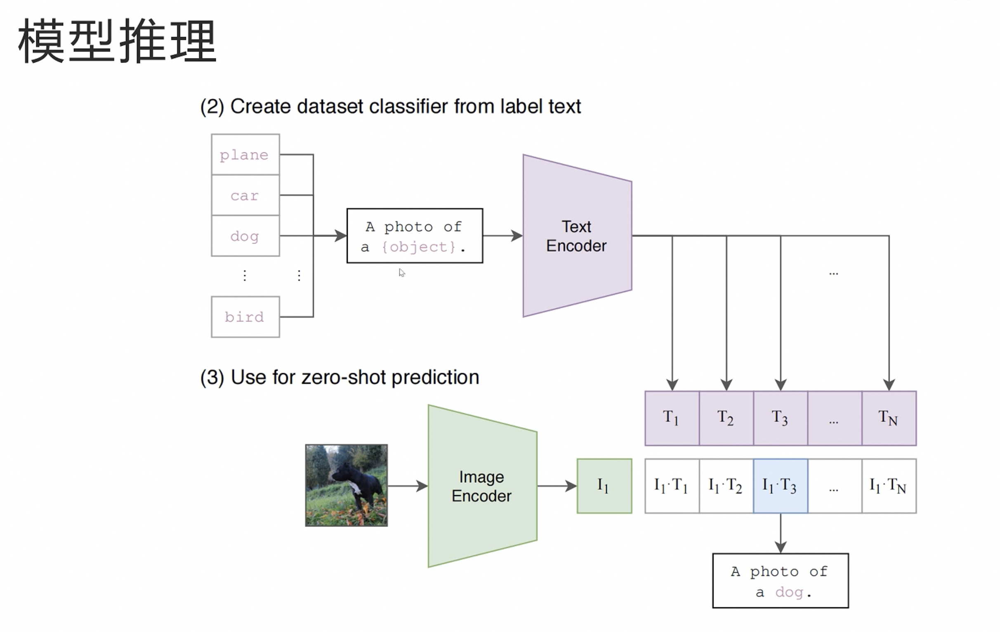
  可通过提示工程和集成的方式提高分类准确率
- **图像检索**：输入文本描述，检索最相关图片

**可能遇到的问题**
- Clip如何选择图像编码器？
  - 在ResNet不同宽度和深度，ViT不同参数量和patch_size上做实验，其中ViT-L/14（额外在高分辨率336*336图片上训练一个epoch，提升精度）表现最佳
  - 实验发现在模型深度、宽度、图像分辨率上同时增加计算量，模型提升优于仅在一个维度上增加算力
- Clip如何选择文本编码器？
  - 采用的是Transformer- decoder，63M参数，12层，512宽度，8注意力头，序列最大长度为76，输入格式为[SOS]输入文本[EOS], 输出[EOS]token embeding为句子的表示，文本编码器对Clip性能影响不大。
- Clip中温度系数
  - CLIP 的温度系数就是对相似度分数（logits）进行缩放，最终影响 softmax 分布的尖锐/平滑程度

## MoCo
**MoCo**（Momentum Contrast）是由Facebook AI Research于2019年提出的自监督对比学习框架，专为解决实例判别下“负样本数量不足”的问题，帮助CNN/视觉模型学习强大的表征能力。

**动机**
- 对比学习如何构造正负样本对？
  - 实例判别
  - 翻译增强
- 对比学习的难点？-> 负样本尽可能多，负样本尽可能一致
  - 没有固定label, 随着模型训练，同一个样本生成的特征一直在变
  - batch_size太小会带来问题 -> batch_size不能无限制大，可以积累多个batch的负样本，梯度只会更新当前batch的参数，历史负样本队列中的特征是“冻结的”，用来做判别和损失计算，但不被梯度流更新
  - 不同batch, 模型不同，生成特征不同，负样本没有意义
- 对比学习的优势？
  - 自监督学习好特征表示后，下游任务简单微调即可取得很好表现

**核心思想**
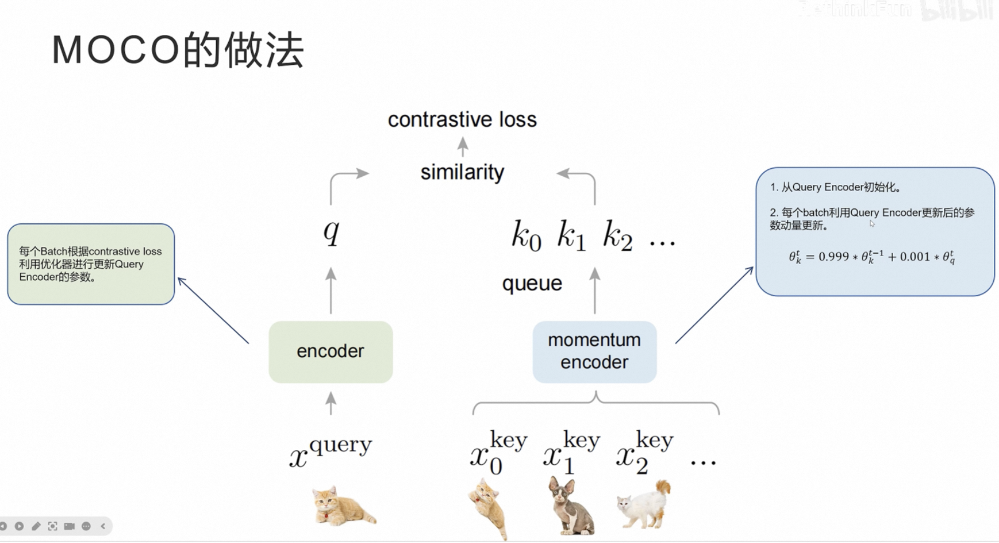

- **队列（Memory Bank）管理大规模负样本。**  
  MoCo维护一个动态“负样本队列”，用以积累历史batch中的负样本特征。
- **Momentum Encoder。**  
  MoCo使用两个编码器：
  - **query encoder**：标准参数，随梯度更新；
  - **key encoder**：参数通过query encoder“动量更新”，即参数缓慢跟随query encoder变化（EMA），保证队列特征的一致性和稳定性。
  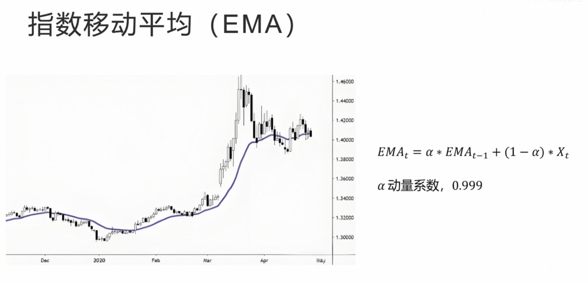

**流程简述**
- **每张图片做两种不同数据增强**→形成“query”和“key”。
- 用 query encoder 提取“query”特征，用 key encoder 提取“key”特征
- 当前 batch 的 key 特征入队，旧特征出队，组成大规模（如4096或65536）负样本库。
- 用 query 对应的 key 形成正样本对，队列中其余为负样本对。
- 用 InfoNCE loss 拉近正样本、推远负样本。

**损失函数（InfoNCE）**

$$\text{loss} = -\log \frac{\exp(\mathrm{sim}(q, k^+)/\tau)}{\exp(\mathrm{sim}(q, k^+)/\tau) + \sum_{k^-} \exp(\mathrm{sim}(q, k^-)/\tau)}$$

- $q$：query特征
- $k^+$：对应key（正样本）
- $k^-$：队列中的负样本
- $\tau$：温度参数

**优点**

- 负样本数量可大幅扩展，突破batch size限制
- 特征分布更稳定，队列中的负样本由动量编码器产生。
- 简单高效，实现和资源消耗友好。

## ALBEF
**ALBEF**（**A**lign**B**efore **F**use）是2021年提出的一种强大的视觉-语言预训练（VLP）框架，全称为**Align Before Fuse: Vision and Language Representation Learning with Momentum Distillation**。ALBEF通过"先对齐后融合"和动量蒸馏等机制，提升多模态表示学习，主要用于图像-文本多模态理解任务，如图像-文本检索、图像描述生成（captioning）、视觉问答（VQA）等。

**背景**

多模态大模型模型结构，经过实验发现，图像编码器十分重要，文本编码器差别不大，融合编码器也相对重要，最后演化为下述架构。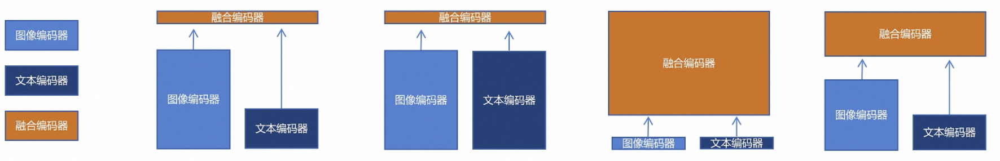

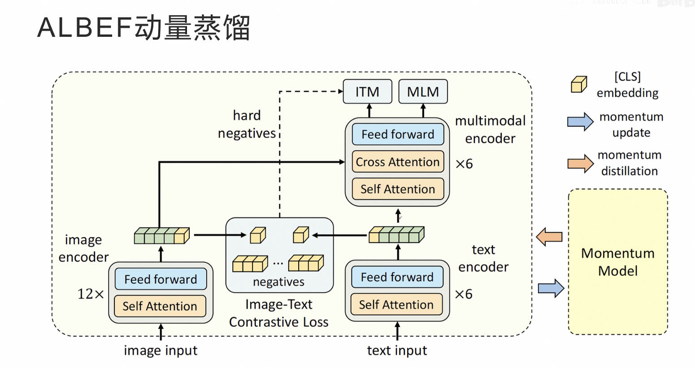

**核心思想**

- **对齐再融合（Align Before Fuse）**  
  ALBEF 首先独立对图像和文本编码进行对齐（alignment），让二者在同一特征空间语义靠近，然后才进行融合（fusion），用于多模态下游任务。
- **联合多任务预训练**  
  同时采用图文对比学习（ITC，Image-Text Contrastive）、图文匹配（ITM，Image-Text Matching）和掩码语言建模（MLM，Masked Language Modeling）三种自监督目标。

**主要组件**

- **视觉编码器**：采用Vision Transformer（ViT），输入图片分为patch，经过12层Self Attention和前馈网络，得到图片patch特征及[CLS]汇总特征。
- **文本编码器**：用Transformer/BERT结构，输入token序列，通过6层Self Attention及前馈模块，输出文本token特征及[CLS]。
- **对齐模块**：正样本来自更新的学生模型，负样本来自动量模型队列。【动量蒸馏】
- **融合模块**：6层文本self-attention和cross-attention和前馈网络, query为文本，key为图片。进行图像文本配对和掩码文本预测任务。【高相似度但实际不配对的“难负样本”进行图像文本配对-二分类任务】

**损失函数**

- **ITC（对比损失）**：最大化对应图像-文本对的相似度。
$$
L_{\text{ITC}} = \frac{1}{2} \Big( \mathrm{cross\_entropy}(\hat{y}^{i2t}(I), p^{i2t}(I)) + \mathrm{cross\_entropy}(\hat{y}^{t2i}(T), p^{t2i}(T)) \Big)
$$
$$
p_m^{i2t}(I) = \frac{\exp(s(I, T_n)/\tau)}{\sum_{m=1}^{M} \exp(s(I, T_m)/\tau)}
$$
$$
p_m^{t2i}(T) = \frac{\exp(s(T, I_m)/\tau)}{\sum_{m=1}^{M} \exp(s(T, I_m)/\tau)}
$$
- **ITM（匹配损失）**：判别输入的图像-文本对是否真的配对。$y^{itm}$ 表示二分类标签（配对/不配对），$p^{itm}(I, T)$为匹配概率。
$$
L_{\text{ITM}} = \mathrm{cross\_entropy}(y^{itm}, p^{itm}(I, T))
$$

- **MLM（掩码语言模型）**：只给部分文本（其他用[mask]），让模型预测被遮盖词。$y^{msk}$ 为掩码后原词，$p^{msk}(T_{msk})$ 为预测概率分布
$$
L_{\text{MLM}} = \mathrm{cross\_entropy}(y^{msk}, p^{msk}(T_{msk}))
$$
其中 。

**优点与应用**

- 有效提升多模态理解和生成，性能优于绝大多数传统VLP框架。
- 适用于图文检索、图文匹配、VQA等多种下游任务。
- 为CLIP、BLIP等一系列后续SOTA多模态大模型奠定基础。

**可能遇到的问题**
- 为什么要用软标签？
  - **one-hot标签“太绝对”**：只用one-hot标签（即匹配对为1，其他全为0），模型学到的信息非常“干脆”，没有对样本间模糊关联和不确定性的敏感度。
  - **软标签（分布式标签）**：
    - ALBEF通过动量模型（momentum model）在对比损失构造时，**不只用one-hot标签进行监督**，还用动量模型产生的分布（即teacher的输出概率分布），作为学生模型学习目标。
    - 换句话说，让学生模型的预测分布尽量“对齐”动量模型的分布，不要求每个pair是完全确定的1和0。

- KL散度加在哪里？
  - 在KL散度里，q是目标分布（老师/希望拟合对象），p是模型分布（学生/当前输出），优化时让p逼近q。($\alpha=0.4$)
  - ITC loss
    $$
    L^{MoD}_{ITC} = (1 - \alpha) * L_{ITC} + \frac{\alpha}{2} \left[ KL\left(q^{i2t}(I) \| p^{i2t}(I)\right) + KL\left(q^{t2i}(T) \| p^{t2i}(T)\right) \right]
    $$
  - MLM loss
    $$
    L^{MoD}_{MLM} = (1 - \alpha) * L_{MLM} + \alpha * KL\left(q^{msk}(I, T_{msk}) \| p^{msk}(I, T_{msk})\right)
    $$
## BLIP
**BLIP** （**B**ootstrapped **L**anguage-**I**mage **P**retraining）是一种由 Salesforce 研究院在 2022 年提出的**多模态预训练框架**。此前 CLIP等方法要用于判别任务（如检索），而BLIP是既能判别、又能生成的通用多模态视觉语言模型，并能有效利用无配对图片数据。

**改进点**：
- 训练一个模型可以做检索也可以做生成：多任务预训练框架
- 解决网络收集图文对数据中的噪声问题：Bootstrapping伪标签生成（自引导数据增强）
  
**结构设计**

BLIP 通过共享文本编码器参数，增加起始文本token[CLS][Encode][Decode]区分不同任务。

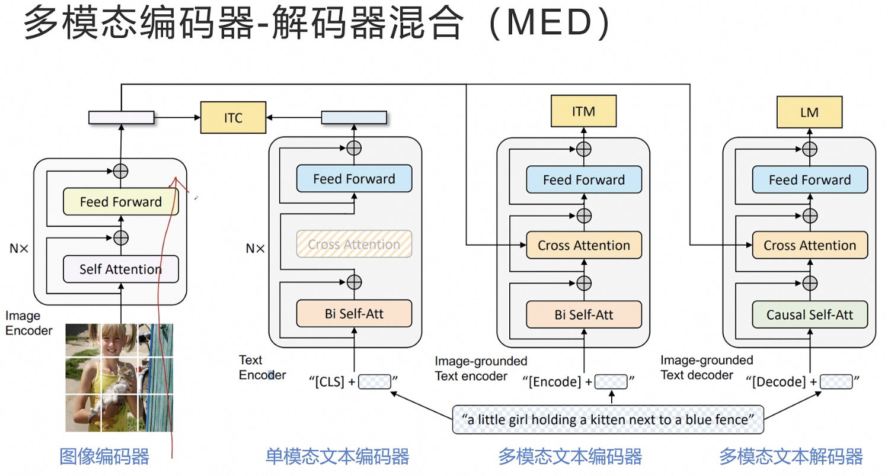

- 图像编码器（Image Encoder）

  - 输入原始图片，送入ViT，经过多层Self Attention和Feed Forward（前馈网络），输出图像特征
- 单模态文本编码器（Text Encoder）

  - 输入为自然语言文本，"[CLS]"为分类起始token，经过多层self-attention和feed forward，输出文本特征
  - 进行判别任务：“图片-文本对比对齐”（ITC）
  
- 多模态文本编码器（Image-grounded Text Encoder）

  - 输入是文本，"[Encode]"为编码起始token，通过多层self-attention和Cross Attention和feed forward，把图像特征融入到文本token的注意力权重中。
  - 交叉注意力模块以图像特征为“键值”，让文本能感知图像内容，形成跨模态深层语义融合。
  - 进行判别任务：图像文本匹配（ITM）
  
- 多模态文本解码器（Image-grounded Text Decoder）

  - 输入是文本，"[Decode]"为编码起始token，通过多层casual self-attention和Cross Attention和feed forward，把图像特征融入到文本token的注意力权重中。
  - 用于生成任务：图像文本生成。

**自引导数据增强**

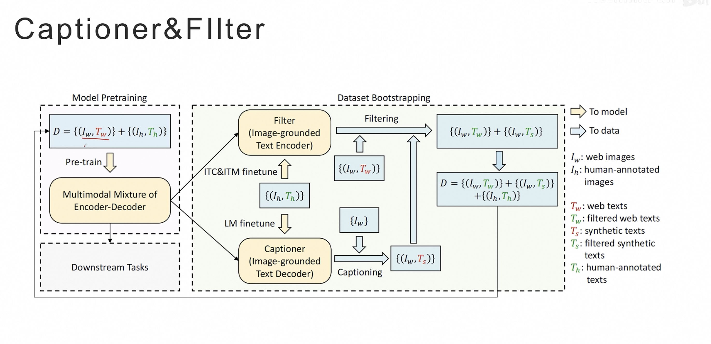

当然可以！下面我将结合你的图，对BLIP中“自引导数据增强”（Bootstrapped Data Augmentation）的流程、关键算法细节，进行详细讲解。
- **初始状态 —— 标注与非标注数据共用**

  - 数据分为两类：
      - 人工标注的图文对 $D_h = \{(I_h,T_h)\}$（比如COCO/Flickr30K等高质量人类标注）
      - 大量网页图片 $I_w$（无配对文本）和网页文本 $T_w$（高噪声、海量，未必为图片真实描述）
  - 仅有少量人工标注，与大规模未标注/弱标注数据混合，无法充分训练大模型。
  - 初次预训练采用“多模态编码-解码混合结构”（ME-D），联合这些数据进行基础学习。

- **数据集自引导扩充流程（Dataset Bootstrapping）**

  - Captioner：基于上一轮的BLIP-多模态解码器，通过精标数据微调，输入无文本描述的图片$I_w$，得到图文对$(I_w, T_s)$。
  - Filter：基于上一轮的BLIP-多模态编码器，通过精标数据微调，输入Captioner生成的图文对$(I_w, T_s)$和弱监督的原始图文对$(I_w, T_w)$, 过滤得到高质量合成和网页图文对。
  
- **多轮循环、自我增强**

  - 经过“生成+过滤”后，新产生的高质量筛选图文对会和原有人类标注数据$\{(I_h, T_h)\}$混合，作为新一轮训练数据$D$，进一步更新模型。

**优势**
  - **无限扩展数据规模**：突破真实人工标注限制，可在开放网络建海量训练样本。
  - **降低噪声影响，提升泛化能力**：通过“生成+筛选”双重机制，确保数据多样性又避免质量劣化。
  - **自组织数据流**：模型自身能力提升推动数据增强，动态Bootstrapping，生态式增长。
  - -**通用能力强**：多任务学习，让模型在描述生成、检索、问答等多模态任务表现都很优越。

**可能遇到的问题**
- BLIP为什么要使用label-smoothing?
  - 原理是在训练时，原本的one-hot标签（某一类概率为1，其余为0），被“平滑”为目标类别为0.9、非目标类别为0.1/(N-1)（N为类别数）。
  - 为了提升模型鲁棒性和泛化能力，尤其是在伪标签较多、数据质量参差不齐的自引导预训练场景，将训练目标分布“软化”，有效防止过拟合、过度自信和训练不稳定问题。
- 为什么captioner和filter不共享参数？
  - 由于共享参数常会使判别器变得“过于宽容”或生成器“过于保守”，所以为了防止目标冲突，提升生成和判别子模块各自的专业能力，两者不共享参数。
- 为什么每次生成新数据后，用全新随机初始化模型重新训练，而不是把老模型参数继续finetune？
  - 自训练（self-training）中，一直用同一个模型finetune训练后会产生“自循环陷阱”（self-training loop trap）。
  - 避免错误与偏见累积，增强模型对新扩展数据的适应能力，提升伪标签利用效率，实现更健壮、泛化更强的多模态表征。
- 生成的随机性影响？
  - Beam Search：宽度固定（beam size），优先选概率最高的路径。输出更确定、模式化，重复度高但合理性强。
  - Nucleus Sampling（Top-p）：在累计概率达到p阈值的候选集合里采样下一个词，带来更多多样性和偶然性但可能出现噪声。【caption使用这个更好】
  
## Flamingo
Flamingo 是 DeepMind 于 2022 年推出的创新性多模态大模型。Flamingo在大语言模型（LLM）/大视觉模型基础上，通过引入灵活插入图片特征的专用模块，实现高效的视觉-文本“少样本”推理。

**动机**
- 多模态few-shot learning模型
- 利用已经训练好的视觉模型和大语言模型

**创新点**
- 桥接强大的预训练视觉和文本大模型
- 处理任意图片、文本、视频混杂数据

**输入输出**
- 接受任意模态混排的序列作为输入，文本作为输出
- prompt里可以通过样例，进行VQA、Caption等任务。

  

**训练数据**
- 图文混排数据（互联网网页），长度256，最多5个图片
- 图像文本对
- 视频文本对

**模型结构**

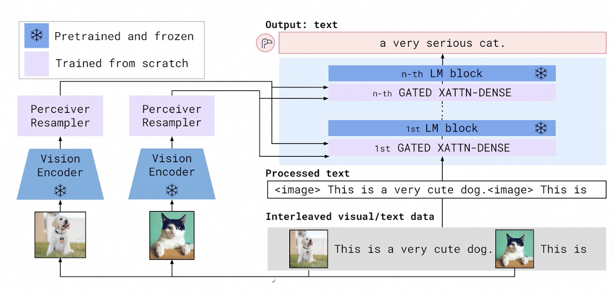

- **输入**: 交错的图片和文本序列，<image>为文本中图片占位token.
- **冻结视觉编码器 + perceiver resampler**: 图片分流经过视觉编码与resampler压缩成视觉token。
- **编码**：
  - **多层多模态融合层**：将视觉 token 与文本 token 拼接灌入“Gated Cross-Attention Block”：文本每一层都可以选择性地吸收视觉 token 信息，通过门控机制控制图片信息注入量。 LM block进一步编码。
  - **语言解码器（基座 LLM）**：最终自回归生成目标文本，支持开放式回答、描述生成或多轮对话。

**提取视觉特征**
- 图片：从ResNet来的特征图展平，输出：固定数量（如64个）视觉token。它是一组可训练token（初始化为64个向量），通过N层Feed Forward、Cross Attention模块反复吸收、融合图片特征。
    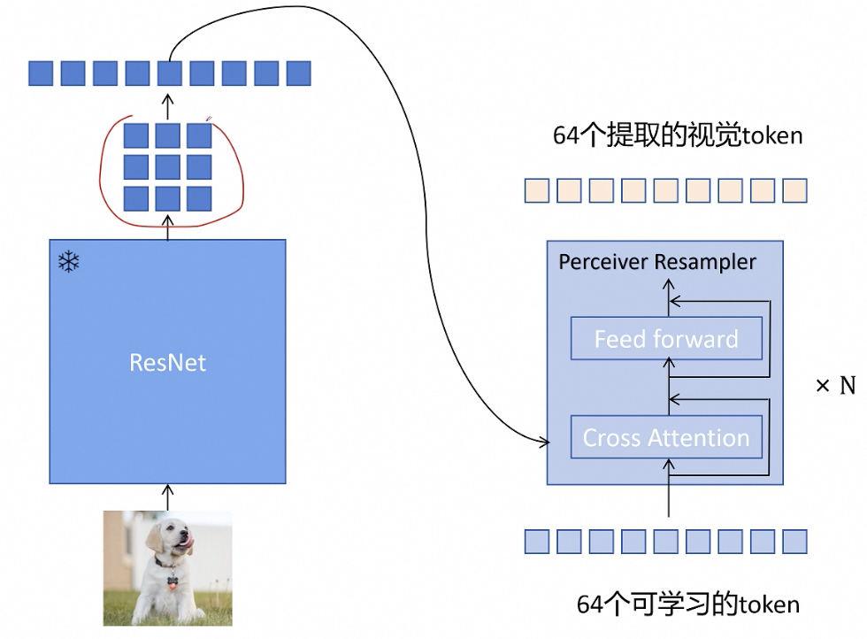
- 视频：每帧都经过ResNet，得到与单张图片特征图。加时间编码后展平，其他同image操作。
    
    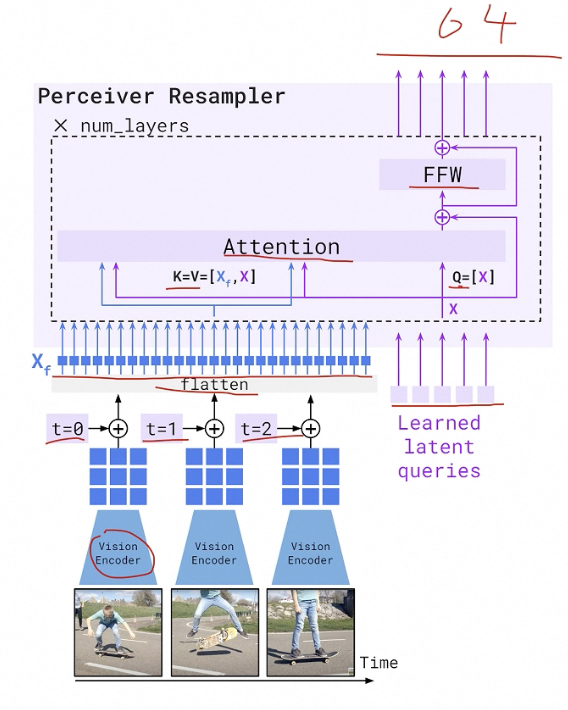

**Gated Xattn-Dense**：
- 文本和图片通过N层 可训练的masked-gated-attention和ffn + 冻结的self-attention和ffn编码
- 这里的mask是指，做交叉注意力时文本只能与最近的一张图做交叉注意力
- 由于后续有self-attention,所以文本可以看到每张图
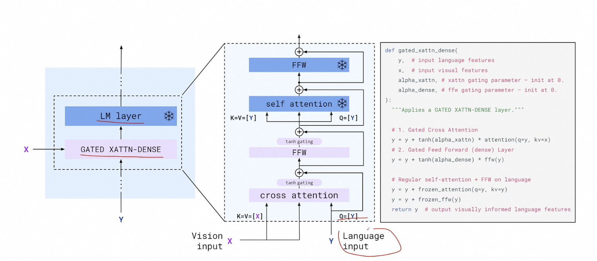

**优势**

- **极强的任务泛化与适应性**  
  只需少量样例或prompt即可适配新任务，不用全量微调。
- **支持灵活多模态上下文结构**  
  能处理任意长度文本、若干图片、多轮问答等复合输入情境。
- **高SOTA性能**  
  多个视觉问答、图片推理与多模态理解任务创下新SOTA（见OK-VQA等公开榜）。
- **模块插拔灵活**  
  便于结合不同LLM、视觉模型和扩展至其它多模态场景。

**应用**

- 视觉问答（VQA, Science QA等）
- 跨模态推理、多轮对话
- 多模态少样本任务设定（Few-shot Learning）

**可能存在的问题**
- 为什么要"Resampler"?
  - 每张图片提取出来的patch数量可能不同，模型难以直接对接文本等其它模态。
- 什么是tanh gated cross-attention？
  - 在常规 cross-attention 的基础上，加了一个“门控机制”（即 gate）。gate 通常是一个 learnable参数（向量），对 cross-attention 输出结果做缩放/抑制。tanh gate 是指对该参数做 tanh 激活，值域在 (-1, 1)，防止门控值无限扩张，增加非线性控制。
- 为什么要加入tanh gated cross-attention？
  - 加 Gate 可以让 cross-attention 层输出不仅靠内容驱动，还能由模型自动决定信息注入量（即完全不注入也是可以的）。
  - 在 Flamingo 架构中，视觉编码器和语言主干是预训练并冻结的，只有 cross-attention 和 gate 模块是新初始化的。将 gate 初始化为 0，可以防止训练初期未学习好的 cross-attention 输出噪声，扰乱文本生成主干，保证模型先保持语言能力，随后再逐步有序地融合视觉信息，提高训练稳定性和效果。
- tanh gated cross-attention 和 llm层数对比？
  - 可以每隔3/7层添加
- loss函数？
  - 自回归模型！！！所以Flamingo 架构图里 LLM block 标注 “Self-Attention”，实际上它指的是 “masked self-attention” ，即解码器专用的自注意力。

## BLIP-2
BLIP-2 是由 Salesforce 等团队在 2023 年提出的多模态视觉语言预训练框架，通过一个桥接模型连接冻结的视觉编码器和大语言模型，通过两阶段训练实现强大的视觉理解与生成能力。

**动机**
- 利用预训练的视觉大模型和语言大模型
- 做生成任务前需要对齐和融合

**Q-former架构**
- Image Transformer 和 Text Transformer 共享self-attention参数，除cross-attention随机初始化外，其他均来自预训练的bert参数。
- Image Transformer输入为32个可训练的token，进行视觉特征提取。
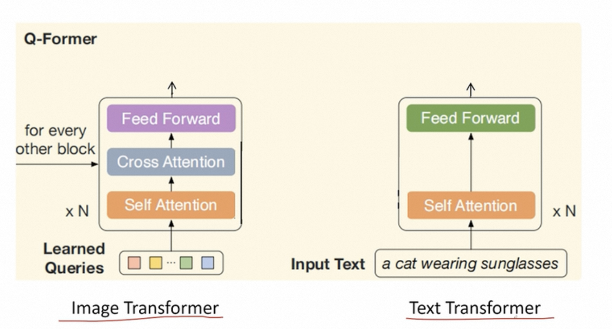

**两阶段训练**

- 第一阶段：视觉语言表示学习 ITC
   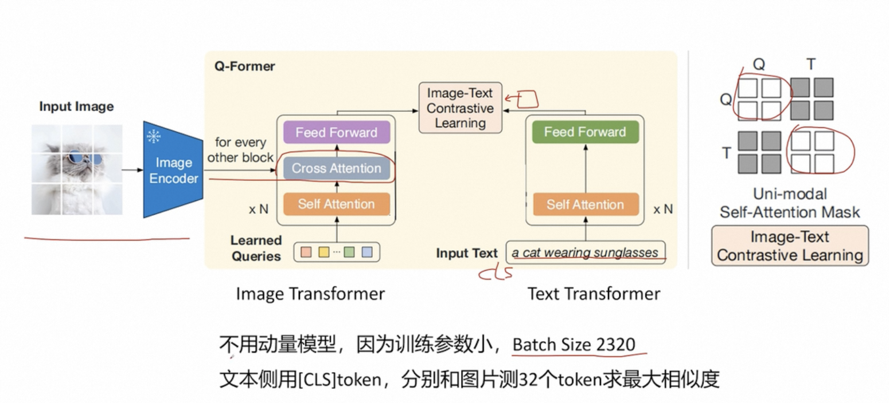
  - 文本加[CLS]token, 最后输出作为文本表征，和图像侧32个token分别求最大相似度作为该组相似度
  - 在self-attention部分，图文无交互
  - 由于参数量很小，所以batch_size很大，为2320，不需要动量模型
- 第一阶段：视觉语言表示学习 ITM
   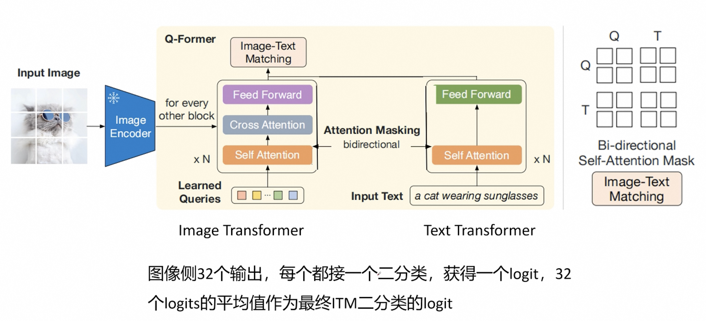
  - 图像文本匹配时，自注意力层，图像和文本都是互相可见的
  - 对32个token都做二分类，取均值作为最后的概率
- 第一阶段：视觉语言表示学习 ITG
   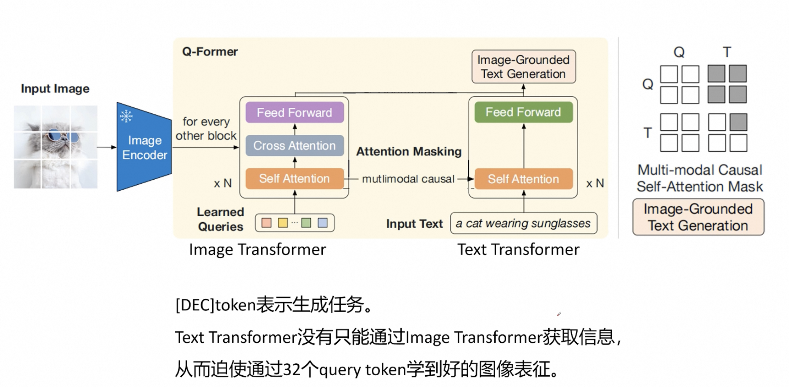
  - 图像文本匹配时，自注意力层，图像看不到文本，文本能看到图像和在它之前的文本
  - 文本加[DEC]Token表示生成任务
  - 最上面的线没有，这应该是共享attention的类单塔
- 第二阶段：基于图像的语言生成
  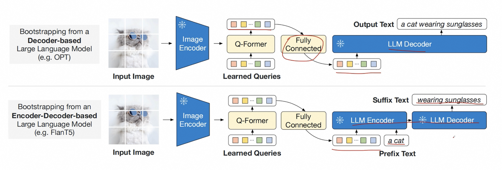

**训练细节**
- 同BLIP，同时经过BLIP生成过滤
- 图像编码器用VIT，删除最后一层，用倒数第一层


**技术优势**

1. **极低算力/高效训练**  
   只需训练桥接模块Q-Former，其余部分均可冻结，资源消耗极低，各类视觉/语言模型易插易换。
2. **泛化性与灵活性突出**  
   支持多种视觉backbone和LLM（主流ViT、LLaMA、OPT等），下游任务迁移快、适应新任务能力强。

**可能存在的问题**
- 为什么BLIP-2:图像编码器用VIT，删除最后一层，用倒数第一层
  - 为了避开“分类头”对特征空间的适配性增强，保留更丰富、更通用的视觉信息，以便Q-Former更好地抽取和对齐多模态语义，从而提升多模态理解和生成的表现。

## LLaVA
LLaVA（Large Language and Vision Assistant）是2023年推出的开源多模态大模型，由 UC San Diego 等团队开发.将强大的开源 LLaMA 类语言模型（LLM）与强视觉编码器进行高效融合，得到可直接用于多模态问答与交互的大模型。

**训练数据**：LLaVA的训练数据主要为图像-文本对问答格式，用于多模态指令微调；根据纯文本信息生成问答对。

**模型架构**

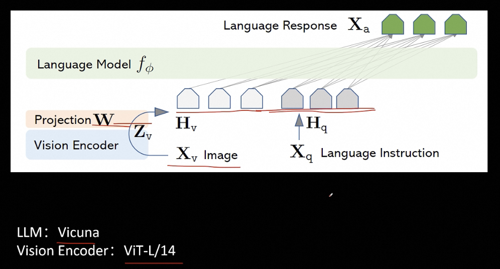

**训练方式**

- **阶段1:特征对齐的预训练**：冻结ViT和LLM，仅训练线性投影层，执行简单描述图片问答任务。
- **阶段2:端到端微调**：冻结视觉编码器，训练线性投影层和LLM，进行指令跟随。
  
## LLaVA-1.5
LLaVA-1.5 是 LLaVA 系列多模态大模型的升级版本，于2023年下半年发布

**改动**：
- 线性投影层变为两层
- 增加不同类型训练数据和prompt类型
- 提升图片分辨率：在ViT-L-336px基础上，切分图片，分块编码展平，拼接resize之后图片编码
  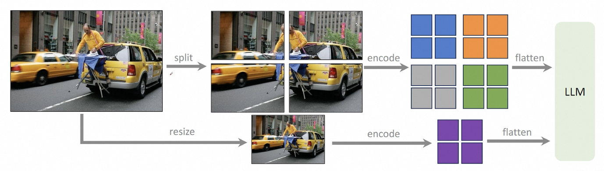
**特点**
- 训练数据还可以减少
- 图片分辨率可以大大缓解多模态幻觉问题
- 多模态大模型有组合分项能力，语言大模型有长文本能力时，训练多模态大模型图片+短文本，一样可以外推至长文本。

## LLaVA-NeXT
LLaVA-NeXT 是 LLaVA 系列多模态大模型的升级版本，于2024年发布

- 进一步提升分辨率
- 高质量数据
- 更大LLM
- 效果接近GPT-4V

## LLaMA3.2-Vision
LLaMA-3 Vision是Meta在2024年首次推出的具备视觉与文本双模输入能力的LLaMA-3家族成员

**图像预处理**
- Tile（分块）：一个 tile560*560，最多4个tile, 缩放图片到缩放比最小的tile
- padding: 剩余位置填充0
- 固定维度feature + mask: 4*3*560*560, mask取决于所占tile数目
  
  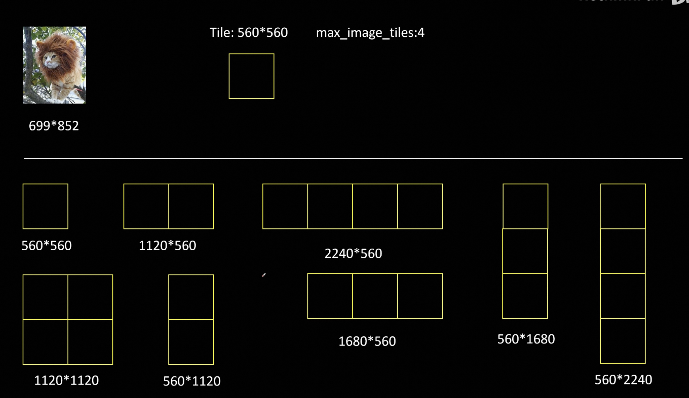  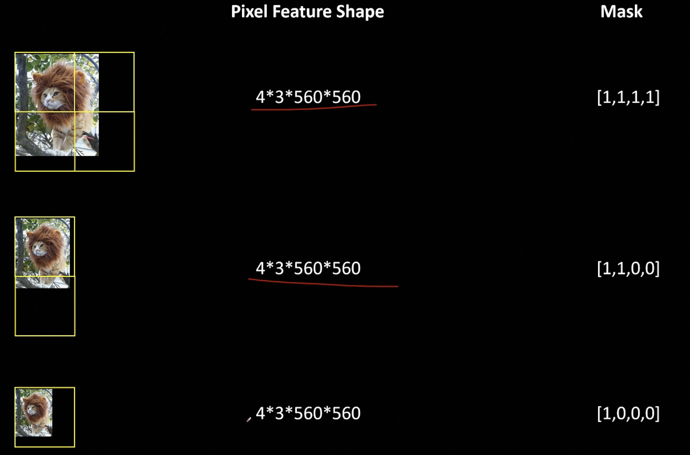

**视觉编码器**
- ViT: 14*14 patch切分，维度1280，展平得到 4*1600*1280
- 位置编码：增加tile位置编码，4个tile，8种可学习的位置编码
- 增加一个[cls]token
- 增加patch位置编码
- 过self-attention和ffn, 再过gated版本
- global + 抽取局部emb，汇总成最后输出结果
  
  

**文本序列**：输入文本图片文本，会自动生成<image>占位符

**多模态融合**：视觉编码器输出后，通过线形映射，成为cross-attention key value，采用decoder llm + gated-cross-attention + lm head生成最后文本描述
【mask只能看到最近的前一张图，但在融合过程中，可以看到前面所有图】

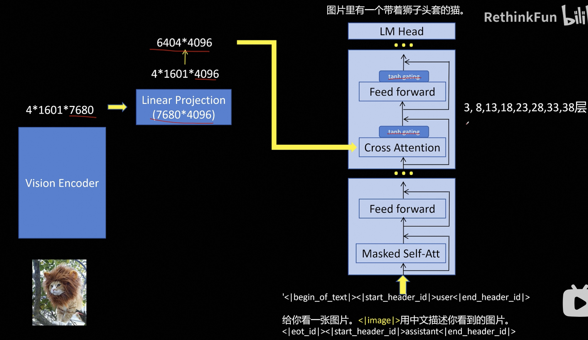