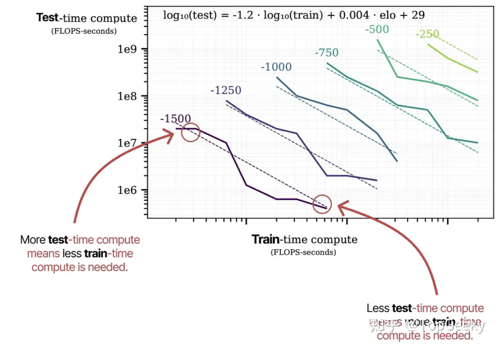

- [推理大模型](#推理大模型)
  - [什么是推理大模型？](#什么是推理大模型)
  - [Scaling Law](#scaling-law)
  - [训练范式](#训练范式)
  - [数据策略](#数据策略)
  - [推理时（Test-Time）策略](#推理时test-time策略)

转载自：https://www.zhihu.com/question/11667247329/answer/1893330399381411428
# 推理大模型
推理（reasoning）模型标志着从扩展训练时间计算到扩展测试时间计算的范式转变。

## 什么是推理大模型？
与普通大模型相比，推理大模型倾向于在回答给定问题之前将问题分解为更小的步骤（通常称为推理步骤或思维过程）。

- 模型形态：显式中间推理轨迹，使用 <think>…</think> 将 reasoning_content 与最终 content（答案）解耦，可在服务侧（如 vLLM）按 </think> 精准切分；</think> 建议注册为单一 special token。

- 目标函数：不仅优化最终答案准确率，还需显式/隐式约束中间步骤的正确性与稳健性（process correctness、一致性、长度/重复惩罚）。
## Scaling Law
Train-time compute = 模型（参数数量）+ 数据集（标记数量）+ 计算（FLOP数量）
训练时计算可能包括训练期间和微调期间所需的计算。
- 为了获得最佳性能，必须同步扩展这三个因素。
- Kaplan 定律指出，在固定计算量的前提下，扩大模型规模通常比增加数据量更为有效；
- Chinchilla 缩放定律表明模型大小和数据同样重要

Test-time Compute = 推理 + 生成答案

## 训练范式
- SFT 基线：与常规 SFT 基本一致，仅在响应中加入 <think>…</think> 模式；多轮样本不保留历史轮的思维链，历史消息在模板中截断到 </think> 之后的纯答案以避免污染上下文。
- RL 增益：结合 outcome-based（只看最终对错）与 process-based（分步奖励）信号，常配合 stepwise reward shaping 与 early-stop 规约。
- 反复读/复读控制：在训练与服务时启用 n-gram repeat/length penalty、max_think_tokens 上限与 stop_at_think_end 早停，降低无效长链。
## 数据策略
以更强模型的思维链为主进行蒸馏（distill），辅以人工修链，形成闭环的“冷启动蒸馏数据”。
## 推理时（Test-Time）策略
长链同时携带信息与噪声，会受 RoPE/注意力稀释影响，过长反而伤精度与后续生成稳定性
提升并非“单次越长越好”，而是多步骤/多调用/多路径
- 分段思维：think → summary → 以 summary 迭代重启 prompt 继续思考；
- Solve-Verify / self-refine / 函数调用与外部工具；
- 多路径生成 + 投票（self-consistency），或多链交互式相互验证；
- 对每次 response 进行独立奖励塑形（用于 RL）。
